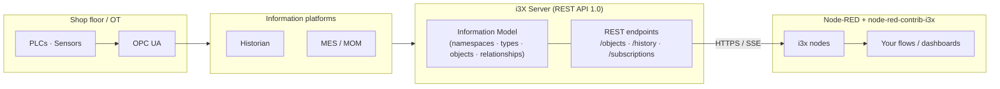
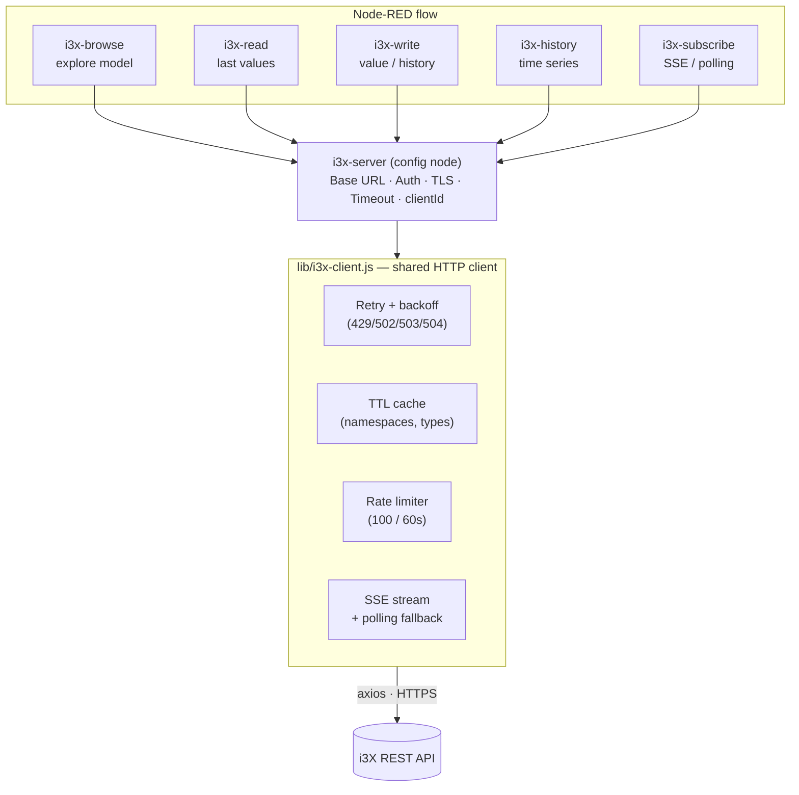
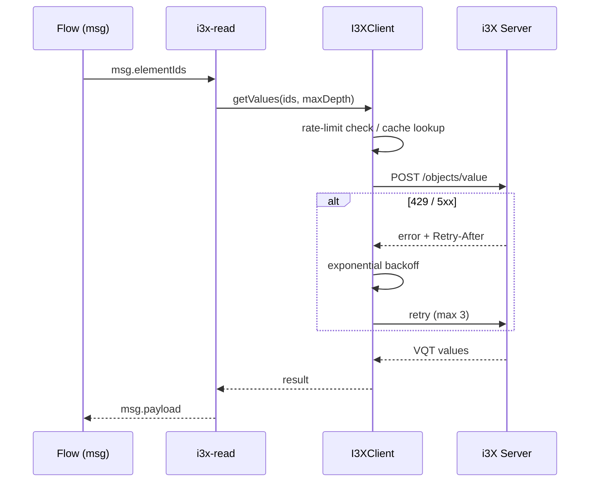

# node-red-contrib-i3x

[](https://www.npmjs.com/package/node-red-contrib-i3x)
[](https://github.com/blanpa/node-red-contrib-i3x/actions/workflows/ci.yml)
[](LICENSE)
[](https://nodejs.org)
[](https://www.i3x.dev)

Node-RED nodes for the **i3X** (Industrial Information Interoperability eXchange) API by [CESMII](https://www.cesmii.org).

i3X is an open, vendor-agnostic REST API specification for standardised access to contextualised manufacturing information platforms (Historians, MES, MOM, etc.).

This package is an i3X **client**: it lets your Node-RED flows browse, read, write, query history, and subscribe against any compliant i3X server. (If you instead need to *expose* an OPC UA address space as an i3X server, see projects like [`node-opcua/node-i3x`](https://github.com/node-opcua/node-i3x) — the two are complementary.)

> **Note:** This package targets the **i3X API 1.0 Release** (finalized 2026-06-09). The specification is stable; the next revision is not expected before the vNext working group convenes in late 2026.

## Architecture

### Where i3X sits

i3X is a standardised REST facade in front of heterogeneous manufacturing
information platforms. This package lets Node-RED act as an **i3X client**,
talking to any compliant i3X server over HTTPS.



### Package internals

Every node delegates HTTP work to a single shared `I3XClient`, configured once
through the `i3x-server` config node. The client centralises all resilience
features (retry, caching, rate limiting, TLS, SSE reconnection).



### Request flow (example: read a value)



## Installation

Install from within Node-RED via **Manage palette → Install**, or from the command line:

```bash
cd ~/.node-red
npm install node-red-contrib-i3x
```

For development / local testing:

```bash
cd ~/.node-red
npm install /path/to/node-red-contrib-i3x
```

## Nodes

All nodes share the category **i3x** and use the same green colour scheme (`#5DB87C`).

### i3x-server (Config Node)

Shared connection configuration used by all other nodes.

| Property    | Description                                                  |
| ----------- | ------------------------------------------------------------ |
| Base URL    | Root URL of the i3X API server (e.g. `https://i3x.cesmii.net`) |
| API Version | Optional path prefix (e.g. `v0`)                             |
| Auth Type   | `none`, `basic`, `bearer`, or `apikey`                       |
| TLS         | Optional TLS configuration (Node-RED TLS Config Node)        |
| Timeout     | HTTP timeout in milliseconds (default 10 000)                |

### i3x-browse

Explore the i3X information model – namespaces, object types, relationship types, objects, and related objects.

**Browse targets:**

| Target              | API Endpoint                          | Description                           |
| ------------------- | ------------------------------------- | ------------------------------------- |
| `namespaces`        | `GET /namespaces`                     | All available namespaces              |
| `objecttypes`       | `GET /objecttypes` or `POST /objecttypes/query` | Type schemas                 |
| `relationshiptypes` | `GET /relationshiptypes` or `POST /relationshiptypes/query` | Relationship type definitions |
| `objects`           | `GET /objects` or `POST /objects/list` | Object instances                     |
| `related`           | `POST /objects/related`               | Graph traversal – related objects     |

### i3x-read

Read the last known values for one or more objects.

- **Input:** `msg.elementIds` (string, comma-separated, or array)
- **Output:** `msg.payload` – value data from `POST /objects/value`
- **Option:** `maxDepth` – controls recursion into child components (0 = infinite, 1 = no recursion)

### i3x-write

Write a current value or historical data to an i3X object.

- **Input:** `msg.payload` (value to write), `msg.elementId` (target)
- **Target:** `value` (default) or `history` – selectable via dropdown or `msg.writeTarget`
- **Output:** `msg.payload` – write confirmation from the API

| Target    | API Endpoint          | Payload format                        |
| --------- | --------------------- | ------------------------------------- |
| `value`   | `PUT /objects/value`  | A value or VQT object `{value, quality?, timestamp?}` |
| `history` | `PUT /objects/history`| A VQT or array of VQT records `[{value, quality, timestamp}, …]` |

Both use the i3X 1.0 bulk update format (`{updates: [{elementId, value}]}`); the node builds it for you. For history writes a missing `quality` defaults to `"Good"` and a missing `timestamp` to the current UTC time.

### i3x-history

Query historical time-series data.

- **Input:** `msg.elementIds`, `msg.startTime`, `msg.endTime`
- **Output:** `msg.payload` – historical data from `POST /objects/history`
- **Time formats:** ISO 8601 (`2025-01-01T00:00:00Z`) or relative (`-1h`, `-7d`, `-30m`, `-2w`)

### i3x-subscribe

Subscribe to value changes via SSE streaming or polling.

- **SSE mode:** Opens a persistent Server-Sent Events stream (`POST /subscriptions/stream`)
- **Polling mode:** Periodically calls `POST /subscriptions/sync`, acknowledging received batches by sequence number
- **Fallback:** If SSE fails — or the server returns HTTP 501 (streaming not supported) — the node automatically falls back to polling
- **Lifecycle:** Subscriptions are created on deploy and deleted on stop/re-deploy; all calls are scoped by a `clientId` derived from the server config node (required by i3X 1.0)

## Built-in Resilience & Best Practices

The shared HTTP client (`lib/i3x-client.js`) implements all [i3X Client Developer Best Practices](https://www.i3x.dev/sdk/category/client-developers):

| Feature | Description |
| ------- | ----------- |
| **Retry with Exponential Backoff** | Automatic retries on 429, 502, 503, 504 with exponential delay |
| **Retry-After Header** | Respects server-provided `Retry-After` headers (seconds and HTTP-date formats) |
| **TTL Caching** | Namespaces and object types are cached for 60 seconds to reduce API load |
| **Rate Limiting** | Client-side sliding-window throttle (100 requests per 60-second window) |
| **Input Sanitization** | Allowlist validation on write payloads to prevent injection of unexpected fields |
| **TLS Certificate Validation** | `rejectUnauthorized: true` by default; overridable via TLS config node |
| **SSE Reconnection** | Automatic reconnection with exponential backoff (up to 5 attempts, max 30s delay) |
| **SSE → Polling Fallback** | Automatic fallback to polling if SSE stream setup fails |
| **Subscription Cleanup** | Subscriptions are deleted server-side on node stop/re-deploy |

## API Endpoints Used

This package targets the [i3X API 1.0 Release](https://api.i3x.dev/v1/docs):

| Category  | Method | Endpoint                     |
| --------- | ------ | ---------------------------- |
| Info      | GET    | `/info`                      |
| Explore   | GET    | `/namespaces`                |
| Explore   | GET    | `/objecttypes`               |
| Explore   | POST   | `/objecttypes/query`         |
| Explore   | GET    | `/relationshiptypes`         |
| Explore   | POST   | `/relationshiptypes/query`   |
| Explore   | GET    | `/objects`                   |
| Explore   | POST   | `/objects/list`              |
| Explore   | POST   | `/objects/related`           |
| Query     | POST   | `/objects/value`             |
| Query     | POST   | `/objects/history`           |
| Update    | PUT    | `/objects/value`             |
| Update    | PUT    | `/objects/history`           |
| Subscribe | POST   | `/subscriptions`             |
| Subscribe | POST   | `/subscriptions/list`        |
| Subscribe | POST   | `/subscriptions/delete`      |
| Subscribe | POST   | `/subscriptions/register`    |
| Subscribe | POST   | `/subscriptions/unregister`  |
| Subscribe | POST   | `/subscriptions/stream`      |
| Subscribe | POST   | `/subscriptions/sync`        |

All subscription requests carry the spec-required `clientId` (derived from the
server config node), which scopes subscriptions per client.

## Example Flows

### Read values from the demo server

```json
[
    {
        "id": "flow1",
        "type": "tab",
        "label": "i3X Demo"
    },
    {
        "id": "server1",
        "type": "i3x-server",
        "name": "CESMII Demo",
        "baseUrl": "https://i3x.cesmii.net",
        "apiVersion": "",
        "authType": "none",
        "timeout": "10000"
    },
    {
        "id": "inject1",
        "type": "inject",
        "name": "Trigger",
        "props": [],
        "repeat": "",
        "once": false,
        "wires": [["browse1"]]
    },
    {
        "id": "browse1",
        "type": "i3x-browse",
        "name": "List Namespaces",
        "server": "server1",
        "browseTarget": "namespaces",
        "wires": [["debug1"]]
    },
    {
        "id": "debug1",
        "type": "debug",
        "name": "Output",
        "active": true
    }
]
```

## Testing

```bash
# Run all tests (unit + integration)
npm test

# Unit tests only (offline, uses HTTP mocks)
npm run test:unit

# Integration tests only (requires network access to demo server)
npm run test:integration

# Unit tests with coverage report
npm run test:coverage

# Lint (ESLint over lib/, nodes/, test/)
npm run lint

# Run all tests in Docker
npm run test:docker
```

See [CONTRIBUTING.md](CONTRIBUTING.md) for the full development workflow.

## Docker

```bash
# Start Node-RED with the i3x nodes pre-installed and the demo flow loaded
docker compose up node-red

# Open http://localhost:18880 in your browser

# Run tests in a container
docker compose run --rm test
```

## Development

```bash
git clone <repo-url>
cd node-red-contrib-i3x
npm install

# Link into Node-RED for development
cd ~/.node-red
npm install /path/to/node-red-contrib-i3x

# Restart Node-RED
node-red
```

## References

- [i3X API Documentation](https://api.i3x.dev/v1/docs)
- [i3X Client Developer Guide](https://www.i3x.dev/sdk/category/client-developers)
- [i3X Specification & RFC](https://github.com/cesmii/i3X)
- [i3X SDK Documentation](https://www.i3x.dev/sdk)
- [CESMII](https://www.cesmii.org)

## License

MIT – see [LICENSE](LICENSE).
